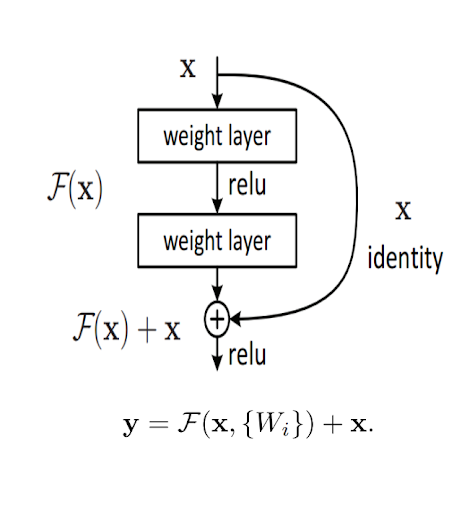
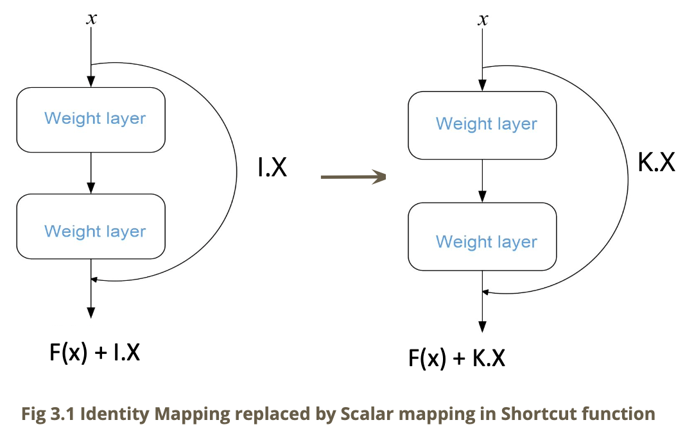
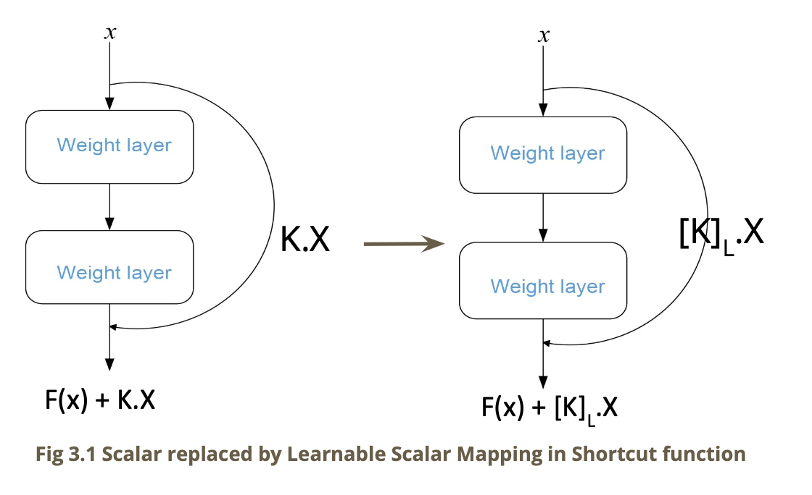
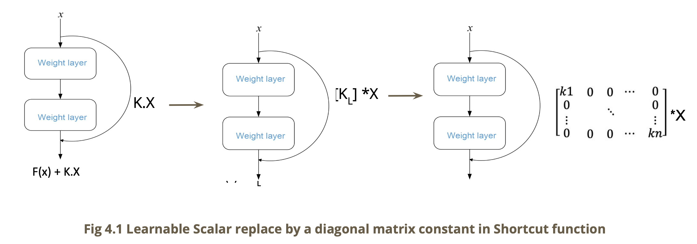
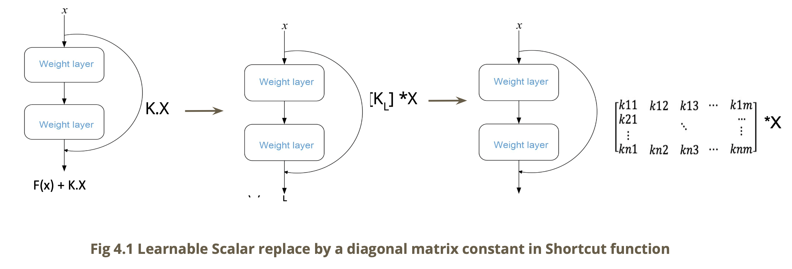

# An exploratory study:<br> Performance analysis of ResNets

## objective:
ResNets is well known to solve the problem of vanishing gradients of deeper
networks.

The main objetive of this project is:
- Can the ResNet architecture be further improved to achieve higher test accuracy?
- Can we leverage our existing knowledge of ResNets, why
they work and explore more in the direction to answer the above
question.


## Why we are doing this project?
Li et. al. presented an Improved ResNet Based on the Adjustable Shortcut Connections. 
https://doi.org/10.1109/ACCESS.2018.2814605

In this work, they presented that accuracy of Resnet improved if shortcut connection is multiplied 
by specific scalar values.

Therefore, we hypothesized that if we multiply the shortcut connection with 
learnable (and non-learnable) parameters, we can improve the accuracy.

Base Case: Default ResNet building block


## Dataset:
CIFAR 10 dataset : 60000 32x32 colour images in 10 classes, with 6000 images per
class. There are 50000 training images and 10000 test images.

## Our Approach
Resnet_50 architecture is used as base case with fix 
100 epochs , learning Rate 0.01, Momentum 0.9. 

Optimizing algorithm = SGD

Following variations in architeture are tested against base case:
#### 1. Scalar Mapping(Convex)




#### 2. Learnable Scalar Mapping with Shortcut lengths (1, 2, 3)



#### 3. Weighted Mapping with Diagonal Matrix and Shortcut length (2)



#### 4. Fully Weighted Mapping with Shortcut length (2)



## Other:
Resume the training by:
```
python main.py --resume --lr=0.01
```